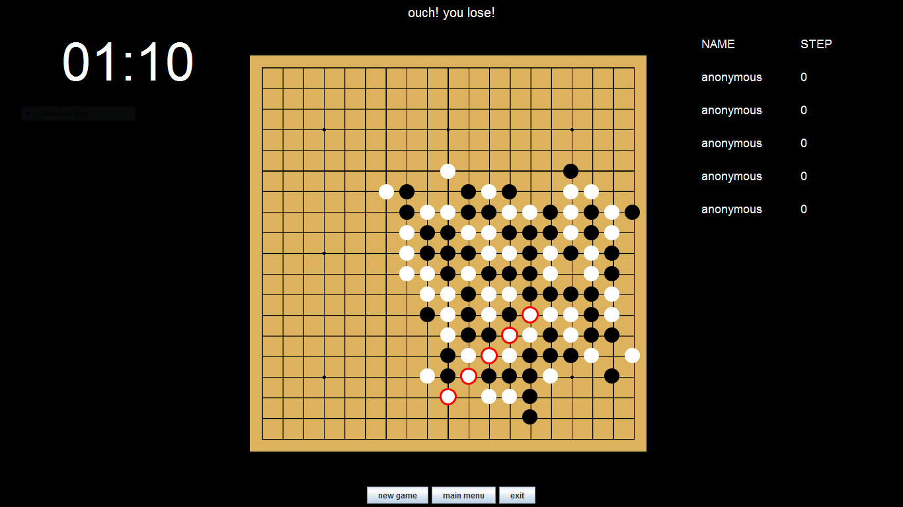

Gomoku
======

## Description

Java based Gomoku game with AI, five same color in a row! 
 
The game rule is just same as the common Gomoku rule. 
The first player color is black, players have to put a stone of their color on an empty intersection alternately. The winner is the first player who creates five stones in a row horizontally, vertically, or diagonally. 
 
On this game, you can play with your friends or play by yourself against computer. 

## Download

[Click here](http://bit.ly/gomoku-jar) for download the .jar
